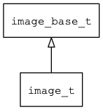

## image\_t
### 概述


 图片控件。
### 函数
<p id="image_t_methods">

| 函数名称 | 说明 | 
| -------- | ------------ | 
| <a href="#image_t_image_cast">image\_cast</a> |  转换为image对象(供脚本语言使用)。
 |
| <a href="#image_t_image_create">image\_create</a> |  创建image对象
 |
| <a href="#image_t_image_set_draw_type">image\_set\_draw\_type</a> |  设置图片的显示方式。
 |
### 属性
<p id="image_t_properties">

| 名属性称 | 类型 | 说明 | 
| -------- | ----- | ------------ | 
| <a href="#image_t_draw_type">draw\_type</a> | image_draw_type_t |  图片的绘制方式(仅在没有旋转和缩放时生效)。
 |
### 事件
<p id="image_t_events">

| 事件名称 | 类型  | 说明 | 
| -------- | ----- | ------- | 
#### image\_cast 函数
* 函数原型：

```
widget_t* image_cast (widget_t* widget);
```

* 参数说明：

-----------------------

| 参数 | 类型 | 说明 |
| -------- | ----- | --------- |
| 返回值 | widget\_t* | image对象。 |
| widget | widget\_t* | image对象。 |
* 函数功能：

> <p id="image_t_image_cast"> 转换为image对象(供脚本语言使用)。


#### image\_create 函数
* 函数原型：

```
widget_t* image_create (widget_t* parent, xy_t x, xy_t y, wh_t w, wh_t h);
```

* 参数说明：

-----------------------

| 参数 | 类型 | 说明 |
| -------- | ----- | --------- |
| 返回值 | widget\_t* | 对象。 |
| parent | widget\_t* | 父控件 |
| x | xy\_t | x坐标 |
| y | xy\_t | y坐标 |
| w | wh\_t | 宽度 |
| h | wh\_t | 高度 |
* 函数功能：

> <p id="image_t_image_create"> 创建image对象


#### image\_set\_draw\_type 函数
* 函数原型：

```
ret_t image_set_draw_type (widget_t* widget, image_draw_type_t draw_type);
```

* 参数说明：

-----------------------

| 参数 | 类型 | 说明 |
| -------- | ----- | --------- |
| 返回值 | ret\_t | 返回RET\_OK表示成功，否则表示失败。 |
| widget | widget\_t* | image对象。 |
| draw\_type | image\_draw\_type\_t | 显示方式(仅在没有旋转和缩放时生效)。 |
* 函数功能：

> <p id="image_t_image_set_draw_type"> 设置图片的显示方式。


#### draw\_type 属性
-----------------------
> <p id="image_t_draw_type"> 图片的绘制方式(仅在没有旋转和缩放时生效)。


* 类型：image\_draw\_type\_t

| 特性 | 是否支持 |
| -------- | ----- |
| 可直接读取 | 是 |
| 可直接修改 | 否 |
| 可持久化   | 是 |
| 可脚本化   | 是 |
| 可在IDE中设置 | 是 |
| 可在XML中设置 | 是 |
| 支通过widget_get_prop读取 | 是 |
| 支通过widget_set_prop修改 | 是 |
